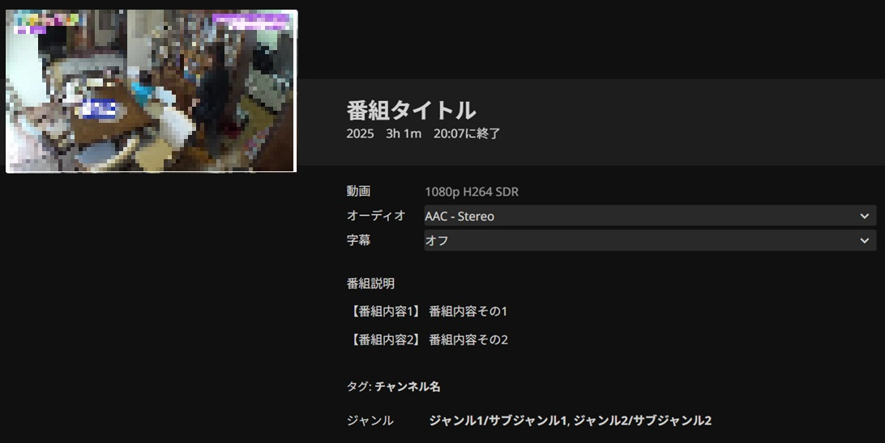

# Jellyfin ARIB EIT Metadata Provider

日本のデジタルテレビ放送を保存したMPEG2-TSファイルに含まれる番組情報を、Jellyfinのメタデータとして取り込むためのプラグインです。
MPEG2-TSファイルの解析は、外部プログラムを呼び出すことで行います。


## 前提条件
- **Jellyfin サーバー**: 10.11.x 以降 (C# SDK 9.0 ビルド)
- **外部解析プログラム**: MPEG2-TSファイルを解析し、特定のJSON形式で結果を標準出力するプログラム


## インストール方法
1.  Jellyfin 管理画面の「プラグイン」設定を開きます。
2.  「リポジトリ管理」「新しいリポジトリ」を開きます。
3.  「リポジトリの名前」に任意の名前を、「リポジトリのURL」に以下のURLを入力します。
    `https://raw.githubusercontent.com/warpzone/jellyfin-plugin-arib-eit/main/manifest.json`
4.  プラグイン一覧から **ARIB EIT Metadata Provider** を選択してインストールし、Jellyfinを再起動します。


## 設定方法
プラグインの設定画面にて、MPEG2-TSを解析するプログラムのパスを指定してください。

例:
- `/usr/bin/python3 /path/to/some_parser_script.py`
- `/usr/local/bin/some_parser_program`


## 外部解析プログラム
本プラグインは、設定されたプログラムを以下の形式で呼び出します。


### 実行形式
```bash
"<設定されたコマンド>" "<MPEG2-TSファイルのフルパス>"
```
解析対象となるファイルの拡張子は、.ts/.m2ts/.m2t/.mtsです。


### 期待される出力 (JSON)
プログラムは、解析結果を以下の形式のJSONで標準出力に出力してください。
下記以外の要素は無視されます。

```json
{
    "channel": {
        "channel_name": "チャンネル名"
    },
    "program": {
        "title": "番組タイトル",
        "description": "番組説明",
        "detail": {
            "番組内容1": "番組内容その1",
            "番組内容2": "番組内容その2"
        },
        "start_time": "2026-01-01T00:00:00+09:00",
        "genre": [
            {
                "major": "ジャンル1",
                "middle": "サブジャンル1"
            },
            {
                "major": "ジャンル2",
                "middle": "サブジャンル2"
            }
        ]
    }
}
```
program.detailやprogram.genreの要素数は可変です。program.detailのキー名は可変です。

このJSONを読み込むと、メタデータはこのように設定されます。


JSON形式は[@tsukumijima](https://github.com/tsukumijima)さん作成の[TSInfoExtractor.py](https://gist.github.com/tsukumijima/48cc26595bc2b05debdba2a655068696)が出力するものに準拠しています。

以下のようなDockerfileを利用することで、jellyfin公式のDockerイメージ内でTSInfoExtractor.pyを実行できるようになります。

```Dockerfile
FROM python:3.13-slim-trixie AS builder

RUN pip install --no-cache-dir ariblib


FROM jellyfin/jellyfin:latest

ENV DEBIAN_FRONTEND=noninteractive
ENV PYTHONPATH=/usr/local/lib/python3.13/dist-packages

RUN set -x \
        && apt-get update \
        && apt-get install -y --no-install-recommends python3-minimal \
        && curl -L -o /usr/local/bin/TSInfoExtractor.py https://gist.github.com/tsukumijima/48cc26595bc2b05debdba2a655068696/raw/1c7868bb1c25065a00ce2675ad42af6a1a40f19f/TSInfoExtractor.py \
        && apt-get clean \
        && rm -rf /var/lib/apt/lists/*

COPY --from=builder /usr/local/lib/python3.13/site-packages/ariblib /usr/local/lib/python3.13/dist-packages/ariblib

RUN set -x \
        && find /usr/local/lib/python3.13/dist-packages/ariblib -name "__pycache__" -type d -exec rm -rf {} +
```


## ライセンス
This project is licensed under the MIT License - see the [LICENSE](LICENSE) file for details.
